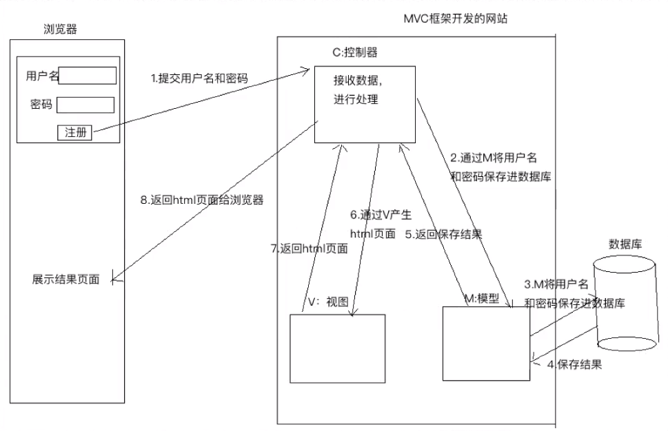
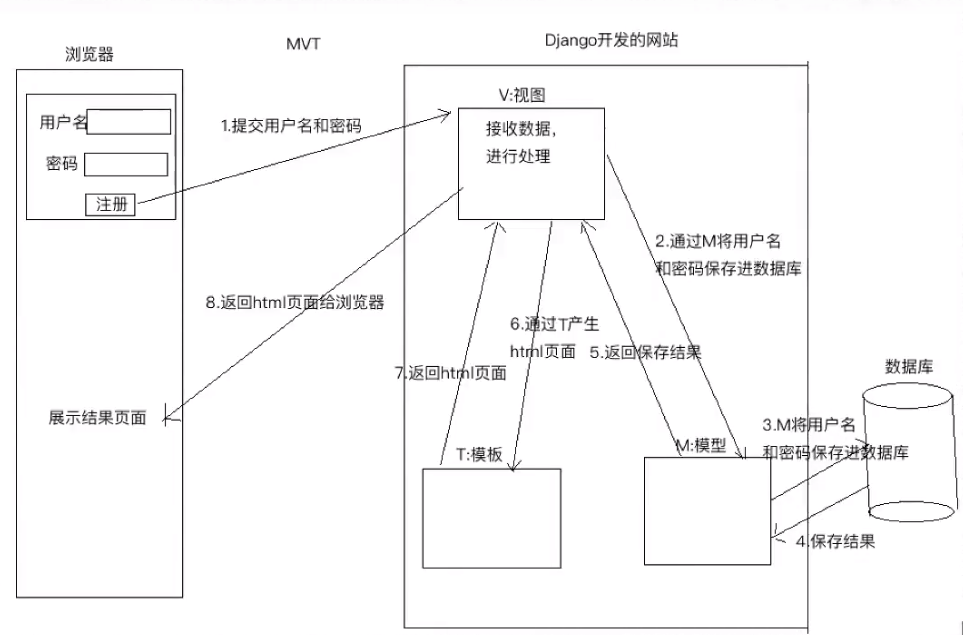

# Django

Django  [ˈdʒæŋɡo] 遵循MVC框架思想，自己创造了 MVT 框架

## Django 简介
Python 开发的开源web开发框架，并遵循MVC设计。
劳伦斯出版集开发

快速开发和DRY(Don't Repeat Yourself)原则

## MVC 软件框架

面向对象，高内聚低耦合

理念：分工，让专门的人去做专门的事。解耦

    输入
    处理
    输出

MVC
    1. M: Model 模型
        1. 负责和数据库进行交互

    1. V: View 视图
        1. 产生HTML页面

    1. C: Controller 控制器
        1. 接收请求,进行处理,与 M 和 V 进行交互
        1. 返回应答

    

MVT
    1. M: Model 
        1. 负责和数据库进行交互

    1. V: View
        1. 接收请求，进行处理，与 M 和 T 进行交互
        1. 返回应答
        1. 同MVC中的C

    1. T: Template
        1. 产生HTML页面
        1. 同MVC中的V
        
    

## 
    

