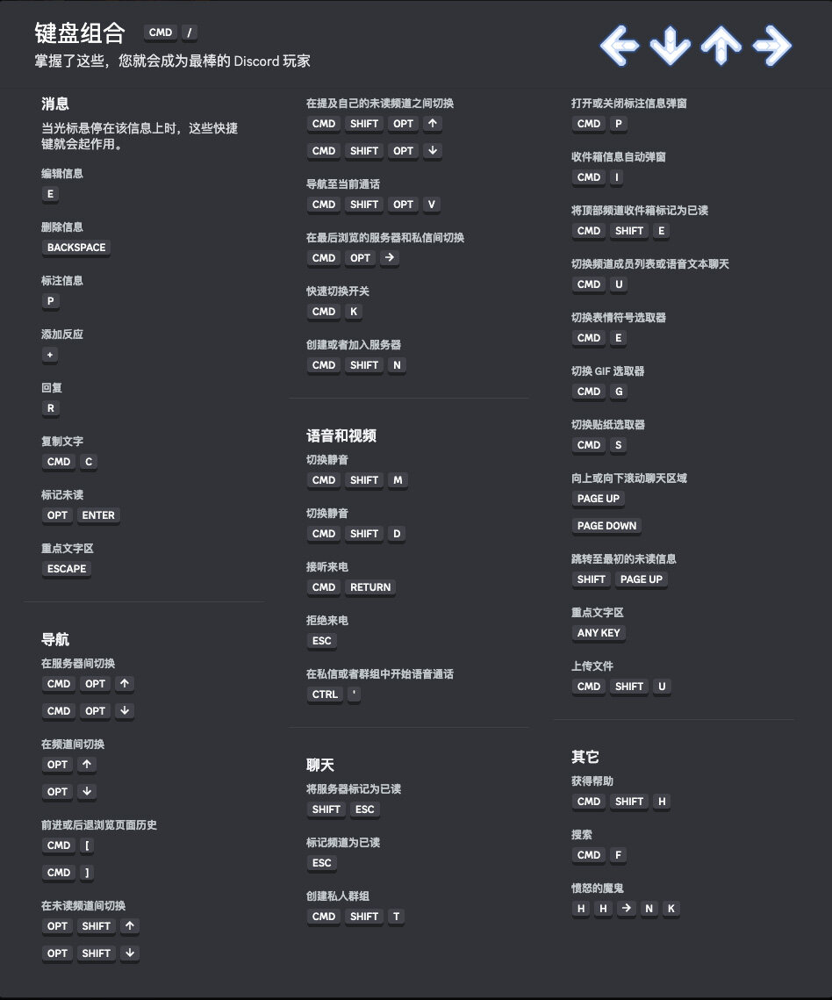

# Midjourney

## 一、[Discord](https://discord.com/)

### 1. [注册](www.discord.com/register)

### 2. 快捷键

### 3. 开发文档

[开发文档](https://discord.com/developers/docs/)

## 二、[Midjourney Documentation](https://docs.midjourney.com/)

### 1. 注册

1. [注册](www.midjourney.com)

2. Join the Beta

3. 在 discord 中点击同意

### 2. 创建自己的服务器和频道

1. 左侧是 server， server 里边有频道

2. 在做侧边栏点击加号，创建自己的服务器

3. 在 midjourney 的 server 中，点击右上角的"显示成员名单"

4. 找到 'Midjourney Bot', 左键单击/添加至服务器, 添加到刚刚创建的服务器，这样更
   就可以在自己的服务器中使用 midjourney 了

### 3. 指令

1. /imagine

   The Midjourney Bot breaks down the words and phrases in a prompt into
   smaller pieces, called tokens, that can be compared to its training data
   and then used to generate an image.

   在对话框中输入此指令加空格，在 prompt 后输入关键词（如：a cat）点击回车，系
   统就会生成对应的插画

   系统会生成四张图片，下面的 U1、U2、U3、U4 代表了显示的四张图；点击其中一个
   按钮，系统就会发给用户对应的图片

   U1, U2, U3, U4 是 upscaling, 放大

   V1, V2, V3, V4 是 variation, 细节调整

   All images are immediately available to view on midjourney.com/app

2. /info

   command to check your Fast Time Remaining

   View information about your account and any queued or running jobs.

3. /subscribe

   use the /subscribe command in any Bot Channel to generate a personal link
   to the midjourney account page. Do not share this personal link with
   others.

4. /help

   Shows helpful basic information and tips about the Midjourney Bot.

5. /ask

   Get an answer to a question.

6. /blend

   Easily blend two images together.

   [Learn how to upload and blend your own images together with the /blend
   command.](https://docs.midjourney.com/v1/docs/blend)

7. /daily_theme

   Toggle notification pings for the #daily-theme channel update

8. /docs

   Use in the official Midjourney Discord server to quickly generate a link to
   topics covered in this user guide!

9. /faq

   Use in the official Midjourney Discord server to quickly generate a link to
   popual prompt craft channel FAQs.

10. /fast

    Switch to Fast mode.

11. /stealth

    For Pro Plan Subscribers: switch to Stealth Mode

12. /public

    For Pro Plan Subscribers: switch to Public Mode

13. /subscribe

    Generate a personal link for a user's account page.

14. /settings

    View and adjust the Midjourney Bot's settings

15. /prefer option

    Create or manage a custom option.

16. /prefer option list

    View your current custom options.

17. /prefer suffix

    Specify a suffix to add to the end of every prompt.

18. /show

    Use an images Job ID to regenerate the Job within Discord.

19. /relax

    Switch to Relax mode.

20. /remix

    Toggle Remix mode.

    Remix mode turned on! Clicking the variation buttons will now `give you a chance to edit your prompt!` You can always turn this off by running
    `/prefer remix` again.

21. /describe

    Writes a prompt based on your image

22. /prefer auto_dm

    完成的工作会自动发送到直接消息 ???

### 4. Direct Messages

1.  How to Message the Bot

    Midjourney subscribers can work one-on-one with the Midjourney Bot in their
    Discord Direct Messages.

    1. Click on the Midjourney Bot from the Member List (or anywhere you see
       the Midjourney Bot's name)

    2. Send any message to the Midjourney Bot.

    3. This will begin your Direct Message conversation with the Midjourney
       Bot.

2.  Prompts

    1. Basic Prompts

       A basic prompt can be as simple as a single word, phrase or emoji

    2. Advanced Prompts

       More advanced prompts can include:

       1. Image Prompts(one or more image URLs)

       1. Prompt Text(multiple text phrases)

       1. Parameters(one or more parameters)

       /imagine http://imageURL1.png http://imageURL2.png description of what to image --para1 --para2

       Image Prompts Text Prompt Parameters

    3. Prompting Notes

       1. Prompt Length

       2. Grammar

          The Midjourney Bot does not understand grammar, sentence structure,
          or words like humans.

          Word choice also matters. More specific synonyms work better in
          many circumstances. Instead of big, try gigantic, enormous, or
          immense.

          Remove words when possible. Fewer words mean each word has a more
          powerful influence.

          Use commas, brackets, and hyphens to help organize your thoughts,
          but know the Midjourney Bot will not reliably interpret them. The
          Midjourney Bot does not consider capitalization.

       3. [Explore how descriptions of artistic mediums, locations, and time
          periods change an image.](https://docs.midjourney.com/docs/explore-prompting)

    Public channels move too fast? Use the `/imagine` command while direct
    messaging with the Midjourney Bot. Images made within your direct messages
    are still subject to content and moderation rules and are visible on the
    Midjourney website.

3.  suffix 后缀

    - --ar 16:9，代表生成 16:9 尺寸的图片

    - --q 5 代表输出高质量的图片（图片质量从 q 1 到 q 5）

    - --version can be abbreviated --v

    - --v 5 版本信息, V5 版本

      Midjourney Model Version 4 has three slightly different "flavors" with
      slight tweaks to the stylistic tuning of the model. Experiment with
      these versions by adding --style 4a, --style 4b, or --style 4c to the
      end of a V4 prompt.

    - --v 4 --style 4c

      is the current default and does not need to be added to the end of a
      prompt.

      Note on Style 4a and 4b

      `--style 4a` and `--style 4b` only support 1:1, 2:3, and 3:2 aspect
      ratios.

      `--style 4c` support aspect ratios up to 1:2 or 2:1.

    - --s, --styleize 风格参数 250

    - --niji 4/5

      The niji model is a collaboration between Midjourney and Spellbrush
      tuned to produce anime and illustrative styles.

      The --niji model has vastly more knowledge of anime, anime styles, and
      anime aesthetics. It's excellent at dynamic and action shots and
      character-focused compositions in general.

    - --test

    - --testp

---

Find Your Direct Messages

Moderators 主持人 /ˈmɒdəreɪtə(r)/
