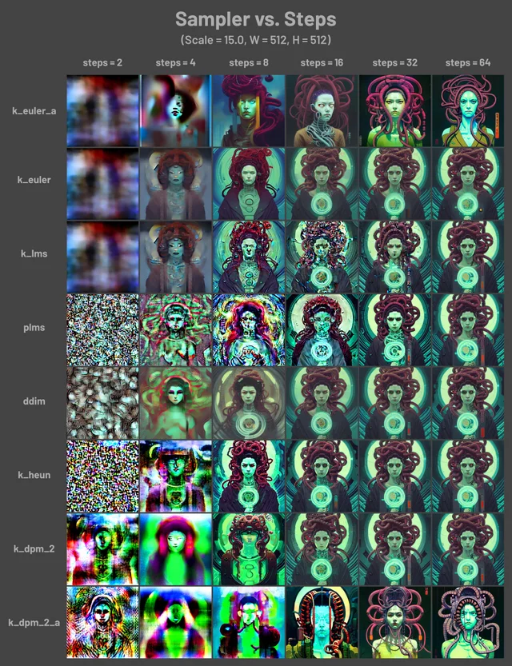

xattn 优化方案

向上采样法提高精度(upcast-sampling)

不使用半精度模型(no-half)

## 模型分类

1. Stable Diffusion 模型
    底模型

2. Embedding 嵌入式模型

3. Hypernetwork 超网格模型

4. VAE 变分自编码器模型

5. LoRA 美化模型

## 生成按钮

1. **read generation parameters from prompt** or last generation if prompt is empty into user interface
    **read generation parameters from prompt** 是什么意思?
    将从提示或上次生成（如果提示为空）中读取的生成参数读入用户界面

2. apply selected style to current prompt

3. save style

## 参考

1. LAION
    [LAION](https://github.com/openai/laion)
    [LAION](https://en.wikipedia.org/wiki/LAION)

    大规模的人工智能开放网络（LAION）是一个德国非营利组织，其既定目标是“制造大
    型机器学习模型，数据集和相关代码，可供普通公众使用”。它以释放从网络上刮下来
    的许多图像和字幕的大量图像和字幕而闻名，这些图像和字幕用于训练许多备受瞩目
    的文本对图像模型，包括稳定的扩散和成像。

2. promptoMANIA

    promptoMANIA is an AI art prompt generator designed to help you create
    stunning, detailed, and reproducible images


2. sampling steps

    - How to see the on-going denoising of the image in Automatic1111's webui?

    - to see the progress of the generation, I only see the last generated
      image.  To see the generation so I can cancel if I don't like where it's
      going and save time.

        settings / Live previews / Show previews of all images generated in a
        batch as a grid

            Show new live preview image every N sampling steps. Set to -1 to
            show after completion of batch.
            每N个采样步骤更新一次实时预览图像，设置为-1以在每批次完成后显示，设置为
            0关闭实时预览 (建议设为0，开启会占用大量显存和显卡算力)

            如果系统配置较低，可以设置为0或者大一些

3. sampling methods

    - StableDiffusion has various options and controls and one of the main ones
      is the sampler used for generation. Let's talk a little bit about these
      samplers since this has some interesting and unexpected effects on
      generated image quality (below image from subreddit) [link twitter](https://twitter.com/iScienceLuvr/status/1564847717066559488?ref_src=twsrc%5Etfw%7Ctwcamp%5Etweetembed%7Ctwterm%5E1564847717066559488%7Ctwgr%5E7d2c5f6f3aa5315eef5dae8400892aa5aa087698%7Ctwcon%5Es1_&ref_url=https%3A%2F%2Fwandb.ai%2Fagatamlyn%2Fbasic-intro%2Freports%2FStable-Diffusion-and-the-Samplers-Mystery--VmlldzoyNTc4MDky)

        

## tab 栏

PNG Info:
    拖进去AI生成的图片会显示出 prompt
    prompt 写进图片的元信息了


tag 描述


## model

1. Im looking for a good photorealistic model like **lexica aperture**. Couldnt
   find a way to download that ckpt though.

    The model behind Lexica Aperture is not available for download.  For an
    alternative, **[Analog Diffusion](https://huggingface.co/wavymulder/Analog-Diffusion)** and **[F222](https://huggingface.co/acheong08/f222/tree/main)** can produce some very
    photorealistic subjects.

## ui

1. [stable-diffusion-webui](https://github.com/openai/stable-diffusion-webui)

2. [stable-diffusion-webui-ux](https://github.com/openai/stable-diffusion-webui-ux)


## controlnet

[ControlNet](https://github.com/Mikubill/sd-webui-controlnet)

    需要下载ControlNet基础模型

    webui/ControlNet-modules-safetensors
    git lfs install
    git clone https://huggingface.co/webui/ControlNet-modules-safetensors

自带的 segmentation 不是很好，推荐使用 https://huggingface.co/spaces/shi-labs/OneFormer

## whilechards

[stable-diffusion-webui-wildcards](https://github.com/AUTOMATIC1111/stable-diffusion-webui-wildcards.git)

stablediffusion/extensions/stable-diffusion-webui-wildcards
    wildcards/
        这里放置标签列表的文本文件
        比如：
            hair.txt
                braided bangs
                side braided
                front braid
                ...

    wildcards/
        这里放置标签列表的文本文件
        比如：
            hair.txt
                braided bangs
                side braided
                front braid
                ...

        https://danbooru.donmai.us/wiki_pages/tag_groups

        prompt 中输入 __hair__, 会自动从 hair.txt 中随机使用

## 三视图

1. CharTurnerBeta - Lora (EXPERIMENTAL)
2. controlnet 三视图骨架图
    1024x512
    高清修复，倍率2
3. prompt

[CharTurnerBeta - Lora (EXPERIMENTAL)](https://civitai.com/models/7252/charturnerbeta-lora-experimental)

This thing is EXPERIMENTAL.
It 100% will try to take over your style and character.

Please use caution. Also, weight it down to .2-.4

Mixes well with charTurnerV2

and is being released EARLY and BEFORE IT'S READY because a few prompts in charTurnerV2 mention it.

I know it has problems. I KNOW IT DOES. It's a beta. :D


prompt:
    solo,(simple background, white background:1.3), multiple views

## extensions

### tag反推器

[tagger - tag反推器](https://github.com/toriato/stable-diffusion-webui-wd14-tagger)

stablediffusion\extensions\stable-diffusion-webui-wd14-tagger

需要重启才生效，setting 里的 restart ui 不管用

### 图片浏览器

https://jihulab.com/Akegarasu/sd-webui-images-browser

### local latent upscaler

局部放大,局部清晰

https://github.com/hnmr293/sd-webui-llul.git


## problems

### 'inpaint at full resolution' is missing

Inpaint at full resolution is now Inpaint area: Whole picture / Only masked  option

stable-diffusion-webui/modules/ui.py

```python
809: inpaint_full_res = gr.Radio(label="Inpaint area", choices=["Whole picture", "Only masked"], type="index", value="Whole picture", elem_id="img2img_inpaint_full_res")
```


## docker

### problems

- 第一次运行报错: /models/VAE-approx/model.pt   doesn't exit

    不关闭程序，重新加载好了

