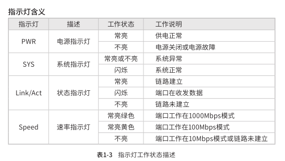

AP:TL-AP1750C-PoE/DC
AC:TL-AC300

状态指示灯
    

默认管理地址
    192.168.1.253/24
    
无感知认证
    “无感知认证”意味着只需要一次成功认证，该无线终端设备即可“记忆”账号，以后只要在无线信号覆盖范围内无需认证，就可以正常上网。

地址租期：DHCP 服务器所分配的 IP 地址的有效使用时间，超时将重新分配

    AP管理
        分组列表
            分组统计信息
                形如“X/Y, Z”，X 表示已经成功接入的 AP 数目，Y 表示分组中所有的 AP 数目，Z 表示分组中的模板数量。

            分组中的表项分为 AP 条目和 AP 模板两种类型
                AP 条目
                    用于对 AP 进行参数设置和管理。当一个 AP 接入之后，就会创建与其对应的AP 条目。AP 条目有固化和未固化的区别。
                        未固化的AP条目：AP下线或AC重启后将消失，并且除“固化”外不能进行任何操作。
                        未固化的 AP 条目名称后会加注“（未固化）”字样。

                        已固化的AP条目：除非用户手动删除,否则一直存在。能够进行修改配置、修改分组、
                        **修改对应射频口配置和绑定无线服务等操作。**
                            
                            ```
                            无线管理>无线服务> 射频绑定 > 新加的AP进行绑定

                            这一步很重要，否则在AP运行状态中该新设备没有射频信道，客户端不能连接该新添加的AP
                            ```

                AP 模板：
                    用于设定某种硬件型号的 AP 的参数默认值，一种型号的 AP 只允许创建一个模板。当 AP 接入时，如果存在与其硬件型号匹配的 AP 模板，就会以其中的参数为默认值生成 AP 条目，且生成的 AP 条目位于模板所在的分组。
                    AP 模板名称后会加注“（模板）”字样。
                
            修改分组：将表项移动到其他分组。不能移动未固化的 AP 条目。
            固化：固化操作。只能对未固化的 AP 条目执行本操作。

            新增AP
                AP 保活时间
                    AP 与 AC 之间采用保活机制来确认隧道是否正常工作。
                    正常情况下，AP 周期性发送回声请求（Echo Request）报文给 AC，AC 收到后发送回声应答（EchoResponse）报文给 AP。
                    如果 AC 在本端的 6 倍保活时间内没有收到回声请求，或者 AP 在自己的 6 倍保活时间内没有收到 AC 的回声应答，则 AC/AP 会主动断开连接。

                客户端保活时间 
                    客户端保活机制用于检测客户端的异常下线。正常情况下，客户端下线时会向AC 发送解关联报文，AC 收到之后就会删除客户端信息。
                    如果客户端由于电源故障等原因异常下线就无法通知 AC, 客户端的信息就会残留在 AC 的内存中，降低 AC 性能。因此，AP 会主动探测客户端是否存在，
                
                客户端闲置时间
                    AP 与客户端之间连接允许的最大闲置时间。如果 AP 在闲置时间内没有收到来自客户端的数据，那么该客户端将被删除。

            负载均衡
                最大失败次数
                    如果客户端反复向设备 A 发起关联请求，且被拒绝请求的次数超过负载均衡设定的最大失败次数，在这种情况下，设备 A 会认为客户端不能连接到其它任何的 AP，将会接受该客户端的关联请求。

                负载均衡使每一个AP分配的连接用户数尽可能平均

                门限
                    当终端所要连接的AP挂载的终端数大于门限，负载均衡才有可能启动。
                    当前连接的用户数量同时达到门限和差值门限，AP才会启动负载均衡

                差值门限
                    AP1 和 AP2 所挂载的客户端数的差值


                如果客户端的信号强度低于负载均衡设置的 RSSI 门限（RSSI，Received Signal Strength Indication，接收的信号强度指示），此弱信号客户端**将不会参与负载均衡的计算。**

                RSSI门限(Received Signal Strength Indication信号强度h指标)
                    它随距离的增大而衰减，通常为负值，该值越接近零说明信号强度越高。
                    如果客户端的信号强度低于负载均衡设置的 RSSI 门限,此弱信号客户端将不会参与负载均衡的计算。

                    

        射频
            beacon帧
                beacon 帧是设备的广播包，用于发布设备支持的 SSID 无线网络。
                无线客户端通过收到的 beacon 帧判断该 SSID 是否还存在，如果长时间都没有收到该SSID 的 beacon 帧，则客户端可以认为该 SSID 已经不存在，客户端就会自动断开与该 SSID 的连接，从而实现无线网络连接同步。
                beacon 间隔表示设备发送 beacon 广播的实际间隔。
                单位：TU(Time Unit)，1TU=1024 微秒。
        
            弱信号限制
                选择“启用”弱信号限制，在右侧的文本框中输入客户端信号强度门限，可以禁止低于设置门限的客户端接入该无线网络。

            弱信号剔除
                选择“启用”弱信号踢除，在右侧的文本框中输入客户端信号强度门限，当客户端的信号强度低于设置门限时，踢除此客户端

            
        频谱导航
            在实际无线网络环境中，某些客户端只能工作在 2.4G 频段上，也有一部分客户端可以同时支持 2.4G 和 5G 频段，如果支持双频的客户端都工作在 2.4G 频段上，会导致 2.4G 频段过载，5G 频段相对空余。
            为了避免频段资源的浪费，可以在设备上开启频谱导航功能。
            频谱导航功能可以将支持双频工作的客户端优先接入 5G 频段，使得两个频段上的客户端数量相对均衡，从而提高整体网络性能。


        无线管理
            SSID (Service Set Identifier,服务集标识)
                当 SSID 包含中文字符时，选择单一编码格式，会由于不同客户端机型和系统上的差异，出现某些客户端可能无法正常搜索和显示 SSID 的情况。
                建议用户在使用中文 SSID 时，设置两个使用相同无线网络名称但采用不同编码格式的无线网络
    
            无线网络内部隔离 
                使连接到同一个无线网络的客户端实现隔离，客户端之间不能互相通信。
                该功能不能跨 AP 生效，即通过不同 AP 接入相同无线网络的客户端之间不能实现隔离。
    
        

### 添加新AP
    1. 将AP连接至PoE交换机,并将开关switch到FIT
    1. AP管理
    1. AP设置
    1. 点击 "分组统计信息" 项目(9/0，0)
    1. 点击刷新,如果没有出现的话，点击 "新增"> 条目类型选择 "AP条目">填写MAC地址
    1. **无线管理,射频绑定**


计算机(笔记本电脑)可以接入PoE交换机


