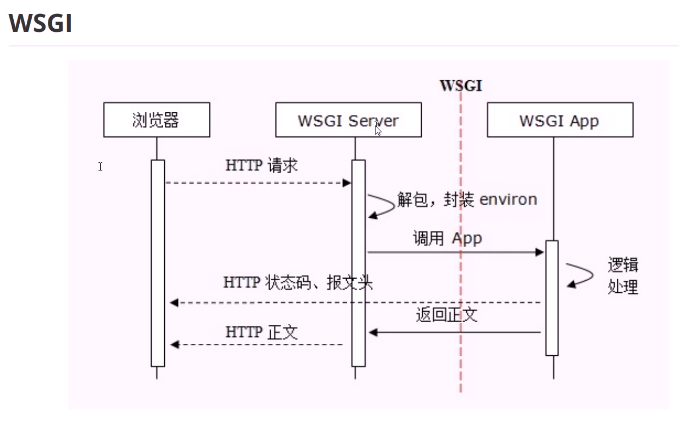

# HTTP协议
https://www.bilibili.com/video/av33617468?p=2

## http协议是无状态协议
同一个客户端的两次请求之间没有任何关系，从服务器的角度来说，它不知道这两个请求来自同一个客户端。
和产生的历史环境有关系，当时的网络环境比较差，硬件设备也比较差，主要用于资料分享，没有交互的需求

## COOKIE
使用COOKIE来解决http协议无状态的缺陷    

1. 键值对信息
1. 浏览器每次发起请求时，都会把COOKIE传给服务器
1. 是一种client && server 传递数据的技术
1. server可以通过判断这些信息，来确定这次请求是否和之前的请求有关系
1. 一般来说cookie信息是在服务器端生成，返回给客户端的
1. 客户端可以自己设置cookie信息
1. 不能跨域
1. 明文保存，明文传输


1. 没有解决数据安全的问题

## URL (uniform resource locator 统一资源定位符)

```
schema://host[:port#]/path/.../[;url-params][?query-string][#anchor]

schema://host[:port#]/path/.../[?query-string][#anchor]

?query-string   查询字符串
    1. ? 后面就是参数了，key=value
    1. & 参数分隔符

```

1. schema
    1. http
    1. https
    1. ftp
    1. file
    1. mailto


## session

Response Headers
Request Headers

```
COOKIE:
_ga=GA1.2.431673896.1540965504; 
_gid=GA1.2.1002287600.1548811242; 
Hm_lvt_3eec0b7da6548cf07db3bc477ea905ee=1548661018,1548811241,1548895697; 
Hm_lpvt_3eec0b7da6548cf07db3bc477ea905ee=1548895702
```


## HTTP 消息

Request
            1. 方法 
            1. 路径
            1. 协议和版本
            1. CRLF 回车换行符

Response

请求
    请求方法
        GET
        POST
        HEAD

    1. get
        **请求方法   请求路径   协议及版本CRLF(回车换行)**

        GET / HTTP/1.1
    
        ```
        GET /w/6/b/b.php?i=08pl9s6reeg&t=pm6mgj HTTP/1.1
        Host: ra.revolvermaps.com
        Connection: keep-alive
        User-Agent: Mozilla/5.0 (Windows NT 10.0; Win64; x64) AppleWebKit/537.36 (KHTML, like Gecko) Chrome/72.0.3626.81 Safari/537.36
        Accept: */*
        Referer: http://ra.revolvermaps.com/w/8/a/a2.php?i=08pl9s6reeg&m=0&c=ff0000&cr1=ffffff&f=arial&l=33
        Accept-Encoding: gzip, deflate
        Accept-Language: zh-CN,zh;q=0.9

        这个是Chrome浏览器>Network>Request Headers>view source
        https 和 http 都可以，有些资源有view source选项，有些没有，多试几个
        ```
        
        get方法请求的东西都放在 request headers 中的第一行,即 GET /...  HTTP1.1

        没有request body
        
    1. post
        
        ```
        POST /w/6/b/b.php?i=08pl9s6reeg&t=pm6mgj HTTP/1.1       //这个中的 /w/6/b/b.php?i=08pl9s6reeg&t=pm6mgj  叫查询字符串
        HOST: 127.0.0.1:9999
        content-length:26
        content-type: application/x-www

        age=58&weight=80&height=170     //这个叫

        应该是都给转成get了，

        ```
        
        

    1. HEAD
        和GET类似，不过不返回消息正文，测试用
   
响应 
    一般有body 

    header 
        **协议及版本  状态码  状态说明**
        
        ```
        HTTP/1.1 200 OK
        Accept-Ranges: bytes
        Cache-Control: max-age=315360000
        Content-Length: 7877
        Content-Type: image/png                     (MIME文档类型)
        Date: Wed, 23 Jan 2019 00:57:40 GMT
        Etag: "1ec5-502264e2ae4c0"
        Expires: Sat, 20 Jan 2029 00:57:40 GMT
        Last-Modified: Wed, 03 Sep 2014 10:00:27 GMT
        Server: Apache
        ```
        
        状态码
            1xx 提示信息，表示请求已被成功接收，继续处理
            2xx 表示正常响应
                200 正常返回了网页内容
            3xx 重定向
                301 页面永久性移走，永久重定向。返回新的URL,浏览器会根据返回到url发起新的request请求
                302 临时重定向
                304 资源未修改，浏览器使用本地缓存

                浏览器收到这个信息，进行跳转
            4xx 客户端请求错误
                1. 404 Not Found, 客户端请求的资源有错
                1. 400 请求语法错误
                1. 401 请求要求身份验证
                1. 403 服务器拒绝请求
            5xx 服务器端错误
                1. 500 服务器内部错误
                1. 502 上有服务器错误，例如nginx反向代理的时候
                    有502就一定是有代理服务器了

                **这个要屏蔽掉，自己写一个统一的回复页面，不然暴露了自己的代码了**
            
## 无状态 有连接 短连接
1. 无状态

1. 有连接：基于TCP/IP

1. 短连接：
    Http 1.1 之前，都是一个请求一个连接，而TCP的链接创建销毁成本高，对服务器有很大压力。
    所以自Http1.1开始，支持keep-alive,默认也开启(true)，一个连接打开后，会保持一段时间（可设置），浏览器再访问该服务器就使用这个TCP连接，减轻了服务器的压力，提高了效率

《HTTP权威指南》


## WSGI



WSGI Server 负责处理HTTP协议的部分,将请求key-values封装成environ 传给 自己写的WSGI APP
    1. key-values
    1. WSGI APP回应浏览器HTTP状态码、报文头的方法

WSGI APP 
    1. 负责处理key-values,返回正文给WSGI Server
    1. 返回浏览器HTTP状态码、报文头

WSGI Server 将正文返还给浏览器


WSGI 主要就是解决Server和APP之间的接口的关系


## WSGI服务器-wsgiref
一个参考，开发中不用，类似OSI-RM

    ```
    from wsgiref.util import setup_testing_defaults
    from wsgiref.simple_server import make_server

    # A relatively simple WSGI application. It's going to print out the
    # environment dictionary after being updated by setup_testing_defaults
    def simple_app(environ, start_response):    //将请求头封装成environ字典, start-response就是
        setup_testing_defaults(environ)

        status = '200 OK'   //状态码 状态说明
        headers = [('Content-type', 'text/plain; charset=utf-8')]

        start_response(status, headers)     //状态码，头

        ret = [("%s: %s\n" % (key, value)).encode("utf-8")
            for key, value in environ.items()]
        return ret  //返回要求可迭代对象，正文就是这个列表的元素，可以是一个元素-字符串

    with make_server('0.0.0.0', 8000, simple_app) as httpd:     //创建server, 有请求了就去调用 simple_app(WSGI APP)
    print("Serving on port 8000...")
    httpd.serve_forever()
    ```


