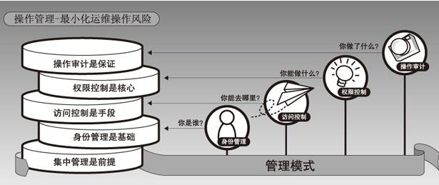

proxy server
Gateway Server
jump server, jump host or jumpbox

 a computer on a network used to access and manage devices in a separate security zone. The most common example is managing a host in a DMZ from trusted networks or computers.

https://en.wikipedia.org/wiki/Jump_server

    就是一个代理服务器，和防火墙是不是有较大关联性

---

第一代堡垒机——跳板机
       第一代堡垒机叫做跳板机。在十几年前，一些高端产业用户为便于远程监控与管理运维人员，多会在机房设置跳板机。跳板机服务器只有 1 台，维修人员在检修时需要统一登录至该服务器内，随后在服务器中再次登录到目标设备展开维护。不过，跳板机在应用时存在诸多问题。

第二代堡垒机

       因为一代跳板机在使用过程中存在较多不足，因此，出现二代堡垒机，对其不足进行完善。二代堡垒机设置在网络系统内，是一种特殊的资源安全访问形式。主要利用SSLVPN 模式，针对内部网络特殊资源的访问还需要事先登录在堡垒机中进行，进而达到用户对常用运维协议的功能要求，通过文本类与图形类一些运维协议的审查。

第三代堡垒机——运维安全堡垒机

       现阶段，需要运维审计的人逐渐增加，用户对堡垒机支持的协议类型要求也逐渐增加。而第三代堡垒的出现，中断了计算机对网络与服务器资源的访问，接管了终端计算机对网络和服务器的访问。融合了多种用户使用要求，其支持的协议也逐渐增加，例如 FTP 协议、数据库协议、Web 应用协议、网管协议。现阶段，市场中售卖的堡垒机多为第三代堡垒机。

http://www.netsys.cn/zxzx/cpfx/437.html

---

运维堡垒主机是什么？有什么作用？

安全考虑，运维人员通常都会通过堡垒主机，进行服务器的日常维护工作。运维堡垒机对运维维护人员的安全操作起着重要的审计和控制作用。在出现重大服务器操作事故时，能够快速有效的定位原因和责任人。

什么是运维堡垒主机？
　　
　　运维堡垒主机是种具备强大防御功能和安全审计功能的服务器。基于跳板机理念，作为内外网络的个安全审计监测点，以达到把所有网站安全问题集中到某台服务器上解决，从而省时省力。同时运维堡垒主机还具备了，对运维人员的远程登录进行集中管理的功能作用。
　　
　　运维堡垒主机是网络中容易受到侵害的主机，所以堡垒主机也必须是自身保护完善的主机。通常至少配备两块网卡设备，分别具备不同的网络连接。个连接外网，用以对目标服务器的远程登录及维护；另个则连接内网，便于内部网络的管理、控制和保护，通过网关服务提供从私网到公网，或从公网到私网的特殊协议路由服务。

运维堡垒主机作用：
　　
　　1. 运维堡垒主机执行的任务对于整个网络安全系统至关重要。由于堡垒主机完全暴露在外网安全威胁之下，需要做许多工作来设计和配置堡垒主机，使它遭到外网攻击成功的风险性减至低。甚至，些网络管理员会用堡垒主机做牺牲品来换取网络的安全。这些主机吸引入侵者的注意力，耗费攻击真正网络主机的时间并且使追踪入侵企图变得更加容易。
　　
　　2. 严格控制、安全审计，才能从源头真正解决问题。运维堡垒主机的严格控制机制和安全审计功能，可以在发生重大服务器操作事故中，发现问题找到事故真正原因所在，及更好的从源头上真正解决服务器安全问题。
　　
　　3. 内部应用服务器。运维堡垒主机存在于内部网络中，通常还会用到作为内网中的专用服务器使用，比如：搭建OA办公系统、内部邮件系统，以及内部协同工作服务器等。
　　
　　运维堡垒主机在企业网络管理中充当着门卫的重要职责，所有内外部对网络设备及服务器的请求，都要通过运维堡垒主机。因此，运维堡垒主机能够拦截非法访问和恶意攻击，对不合法命令进行阻断、过滤掉所有对目标设备的非法访问行为。总之，运维堡垒主机能够大的保护企业内部网络设备及服务器资源的安全性，使得企业内部网络管理合理化和专业化。

https://vps.zzidc.com/vpsjishu/847.html

---

跳板机在攻击者手中还有其他的作用：
　　
　　1. 塞满服务器的硬盘
　　
　　通常，如果服务器可以没有限制地执行写操作，攻击者可以通过发送垃圾邮件. 构造大量的错误信息、向匿名FTP塞垃圾文件等方式塞满服务器的硬盘。跳板机就成为了塞满硬盘造成DOS攻击的途径。
　　
　　2. SYN洪水攻击
　　
　　如果服务器的SYN请求超过了服务器能容纳的限度，缓冲区（BacklogQueue）队列满，那么服务器就不再接收新的请求了。其他合法用户的连接都被拒绝掉。攻击者可以利用跳板机隐蔽自己主机真实IP同时利用其对目标服务器进行SYN洪水攻击。
　　
　　3. IP欺骗DOS攻击
　　
　　这种攻击利用RST位来实现。假设现在有个合法用户(1.1.1.1)已经同服务器建立了正常的连接，攻击者构造攻击的TCP数据，伪装自己的IP为1.1.1.1，并向服务器发送个带有RST位的TCP数据段。服务器接收到这样的数据后，认为从1.1.1.1发送的连接有错误，就会清空缓冲区中建立好的连接。这时，如果合法用户1.1.1.1再发送合法数据，服务器就已经没有这样的连接了，该用户就必须从新开始建立连接。攻击时，伪造大量的IP地址，向目标发送RST数据，使服务器不对合法用户服务。
　　
　　4. 带宽DOS攻击
　　
　　攻击者可以利用跳板机发送请求，来消耗目标服务器缓冲区和服务器带宽，配合上SYN起实施DOS，威力巨大。当然，这种方法是比较初的DOS攻击，并不能够给大型服务器，或者高带宽服务器造成比较严重的伤害。随着云计算技术的出现，分布式存储的应用，这种初DOS攻击已经开始很少被使用，和起到明显的效果。

https://www.cnblogs.com/iors/p/9775572.html

---

简易的堡垒机称为跳板机。功能简单，主要核心功能是远程登录服务器和日志审计。

优秀的开源软件：jumpserver

端口限制iptables、登陆限制sshd_config、客户机日志审计、用户命令权限限制 jailkit

https://yq.aliyun.com/articles/690902?spm=a2c4e.11155472.0.0.6b9f61a3zxqD7T

