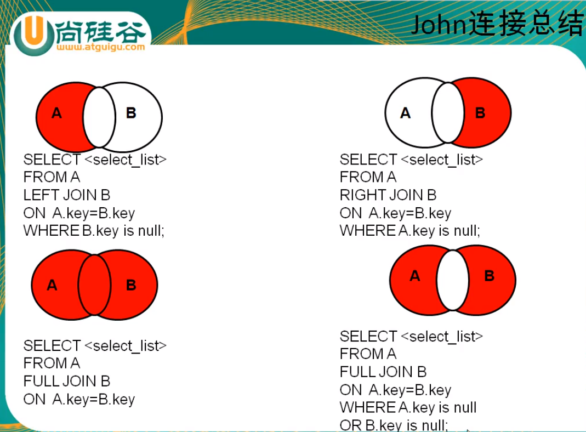

表 和 OOP的类 很相似，所以字段会出现在 Python中,每一列类似属性

show tables from 库名;
select database();
select version();
select user();

create database `aaa` default character utf8 collate utf8_general_ci;

comment ' '


原来mysql支持的 utf8 编码最大字符长度为 3 字节
MySQL在5.5.3之后增加了这个 utf8mb4 的编码，mb4 就是most bytes 4的意思，专门用来兼容四字节的unicode,utf8mb4是utf8的超集

CHARSET=utf8mb4

varchar(N) N是字符,不是字节

truncate table `teacher_info`

desc 表名;

如果是不支持事务的引擎，如myisam，则是否commit都没有效的
如果是支持事务的引擎，如innodb，则得知道你事物支持是否自动提交事务（即commit）
看自己的数据库是否是自动commit，可以使用mysql> show variables like '%autocommit%';来进行查看，如果是OFF即不自动commit，需要手动commit操作（命令行可以直接“commit；“命令），否则是自动commit。

sql语句不区分大小写，但是库、表、字段、区分大小写

单行注释 #
单行注释 -- --
多行注释 /* */


DDL定义语言define
DML（data manipulation language）数据操纵语言：
DCL
DQL查询语言
    select 字段、常量、表达式、函数
        函数: database();
    没有字符 和 字符串的概念，单引号即可
TCL 事务控制语言


别名 as (可以省略)

建议用双引号

去重 select distinct 字段
    select distinct a,b from 表名;

+ 的作用
    1. 字符串可以转换为数字:数学运算
        select '123'+1
    1. 字符串不可以转换为数字:字符转换为零
        select 'name'+1
    1. 有一个操作数是 Null，则结果为Null
    1. '123abc'+1 =>12

concat
    select concat(a,b,...);
    select concat(a,',',b,...);

    **如果某条记录的某一个字段值为Null,则 concat的结果只有一个Null**


IFNULL(为Null的字段,你希望显示的默认值)
    select concat(a,IFNULL(name,"无名氏")) from 表名;


=
!=

and or not 
    主要用来连接条件表达式
    select * from schoolinfo
    where self_desc is NULL
    and score>90;

>
**not >**
    select * from schoolinfo 
    where not (id>4);


like
not like
    %
    _单个字符
    转义\
    或者 用ESCAPE指定转义符号
        select * from schoolinfo where name like '_$_%' escape '$';

    **like '%' 不能匹配NULL**
    相比较于 concat , where name like '%' or id like '%' 不会像concat那样，有一个字段为NULL，就整个为NULL，like 会更普通
        select * from beauty where name like '%';
        select concat(name,photo) from beauty;

    可以判断数值型
    
between and 
not between and 
    [] 闭区间
    等价于 >=  <=，两个操作数不能颠倒顺序

in 
not in
    等价于 = and 
    wehre field in(值1,值2);
    当然了这个字段的值类型是一样的
    in里面的值不支持模糊

is null
is not null
    和null相关的计算都是null
        lenght,char_length

isnull 函数
    isnull(filed) 是返回1,否返回0

安全等于 <=>
    可以判断NULL
    = plus is NULL


select 数据 from 表明  where 条件;
    对每一条数据进行条件匹配,如果没有条件，则每一条记录都为True，会执行select输出
    select更像是print

    select * from beauty where true;    结果为全部数据
    select * from beauty where false;  结果为空


排序
    order by 字段 desc;降序
    order by 字段 asc;升序
    order by 表达式
        select * from beauty order by concat(name,id);
            结果 Angelababy 成为第一个
    order by 别名


length()
    null 的length 还是null


## 关于null的总结
NULL值与任何其它值的比较（即使是NULL）永远返回false
null 的length 还是null
% 不匹配 null
运算操作和null沾边都变为null


## 关于大小写
1. 数据库名和表名是严格区分大小写的
2. 表的别名严格区分小大写
3. **列名与列的别名在所有情况下均是忽略小大写的, 字段的值是不区分大小写的**
    对于字段的值，想要区分大小写，可以使用BINARY加以限制。不管是在创建表的时候，还是在查询的条件字句中都可以使用。
    create table test(name varchar(10),name2 varchar(10) binary);
    insert into test values('Abc','Abc');
    select * from test where name='abc' 有
    select * from test where name2='abc' 无
    select * from test where binary name2='abc' 无
    其实是更改了这个字段的 collate
        utf8 就是 utf8_bin
        utf8mb4 就是 utf8mb4_bin
4. 变量名也是严格区分大小写的

not null 和 binary 不能一块使用吗?

## 常见函数

show variables like "%character%"
show variables like "%time_zone%"
    set time_zone='+9:00'
show variables like "%autocommit%"


### 单行函数
1. 字符函数
    length
        返回的是字节数    
    char_length
        返回字符数

    案例
        ```
        select a.*,(
            select char_length(b.name)
            from beauty b
            where a.id = b.id
        ) from beauty a;
        ```

1. concat
1. upper()
1. lower()

1. substr/substring('string',start[,char_length])
    索引从1开始
    闭区间

1. instr('helloworld','hello')  参数二在参数一中第一次出现时的索引
    没有则返回零

1. trim(' helo ') 去除前后空格
    char_length 和 length 都会计算空格字符' '
    \t \n 等算一个字符

1. trim( 'a' from '目标字符串')

1. lpad('a',char-length,'filled-char')
    num是总长度
    lpad('刘蛟', 5, '*') => ***刘蛟

1. rpad('abc',num,'char')

1. replace('hello world','hello','HELLO')

1. cast
    CAST函数语法规则是：Cast(字段名 as 转换的类型 )，其中类型可以为：

    CHAR[(N)] 字符型 
    DATE 日期型
    DATETIME 日期和时间型
    DECIMAL float型
    SIGNED int
        +-------------------------+
        | cast(now() as signed)   |
        |-------------------------|
        | 20190620200458          |
        +-------------------------+
    TIME 时间型

    select cast(now(),date)

    我觉得主要是 字符串和时间类型的转换，但是 date(),time(),year() 也可以啊

    mysql root@(none):bill> select * from tt;
    +------------+
    | mdate      |
    |------------|
    | 2019-01-01 |
    | 2018/02/02 |
    +------------+
    2 rows in set
    Time: 0.024s
    mysql root@(none):bill> select datetime(mdate) from tt;
    (1064, "You have an error in your SQL syntax; check the manual that corresponds to your MySQL server version for the right syntax to use near '(mdate) from tt' at line 1")
    mysql root@(none):bill> select cast(mdate as datetime) from tt;
    +---------------------------+
    | cast(mdate as datetime)   |
    |---------------------------|
    | 2019-01-01 00:00:00       |
    | 2018-02-02 00:00:00       |
    +---------------------------+


### 数学函数
1. round(1.65)    四舍五入,默认到整数
    round(1.654,2)   2 表示小数保存两位)
1. truncate(1.29,1)  小数点后截断只剩1位
1. ceil() 向上取整
1. floor() 向下取整
1. mod(10,3)    `**取余数  a-a/b*b**
    被除数是整数，结果为整数；被除数是负数，结果为负数

### 日期函数
1. now()    2019-06-18 16:44:03 
1. curdate()    
1. curtime()
1. date(now())
1. time(now())

1. year(now())
1. month(now())
    monthname(now()) 英文名字
1. day(now())   几号
    dayname(now())  星期几
1. hour()
1. minute()
1. second()

1. str_to_date('02-05-2019','%d-%m-%Y') 转换为默认的 年-月-日 格式 => 2019-05-02

1. date_format('2019/6/6','%Y年%m月%d日')   也就是说sql会自动识别日期中的 - 或 / ,只要是 年月日 顺序
1. date_format(now(),'%Y年%m月%d日')
    转换为指定格式

1. 时间运算
    datediff(date1,date2) date1靠后, date2靠前  这两个参数必须有 date
    timediff(time1,time2) time1靠后, time2靠前  这两个参数必须有 time
    
    select timediff('2018-01-02 12:00:00','2018-01-01 11:00');
        1 day, 1:00:00 

    select timediff('2018-01-02 12:00:00','2018-01-01 13:00')
        23:00:00

    https://www.cnblogs.com/yangjinwang/p/6253131.html

### 流程控制
1. if(表达式,表达式为真的结果,表达式为假的结果)
    select if(10>2,'Hello','world');

1. case
    case 将会是一个新的列
    1. 类似switch
        case 表达式 
        when 常量1 then 要显示的值1或语句1
        when 常量2 then 要显示的值2或语句2
        else 要显示的值n或语句n
        end as 别名
        from 表名;

        ```
        select name,salary,
        case name
        when 'A' then salary*2
        else salary
        end as new_salary
        from teacher_info;
        +--------+----------+--------------+
        | name   |   salary |   new_salary |
        |--------+----------+--------------|
        | A      |     9000 |        18000 |
        | B      |     8000 |         8000 |
        | Ac     |     8500 |         8500 |
        | bc     |     7000 |         7000 |
        | A      |    10000 |        20000 |
        | B      |    20000 |        20000 |
        | BB     |   <null> |       <null> |
        | 刘     |    90000 |        90000 |
        +--------+----------+--------------+
        ```

    1. 类似多重if
        case 
        when 条件1 then 要显示的值1或语句1
        when 条件2 then 要显示的值2或语句2
        ...
        else 要显示的值n或语句n
        end

        ```
        select salary,
        case
        when salary<10000 THEN 'Z'
        when salary>20000 THEN 'A'
        when salary>10000 then 'b'
        else 'd'
        END as 工资级别
        from teacher_info;
        +----------+------------+
        |   salary | 工资级别   |
        |----------+------------|
        |     9000 | Z          |
        |     8000 | Z          |
        |     8500 | Z          |
        |     7000 | Z          |
        |    10000 | d          |
        |    20000 | b          |
        |   <null> | d          |
        |    90000 | A          |
        +----------+------------+
        ```


### 分组函数(统计函数，聚合函数，组函数)
功能:用作统计使用

avg

sum
    select name,sum(salary) from teacher_info group by name;
    一定要group by 分组的依据,条件
    参数为字符串的话 结果为0
    Null没有参与运算
        select sum(self) from (select self_desc AS self from teacher_info where id in (9,10)) as tab;

max
    可以用于字符串
    可以用于时间

min
    可以用于字符串
    可以用于时间

count
    任何类型,非空不计算在内
    count(*) 一条记录中只要有一个字段不为null,就算在count里
    count(1) 相当于加了一列值为1的列 求count

    MYISAM下 count(*) 效率高
    INNODB下 count(*) 和 count(1) 效率差不多,但比count(字段) 高, 字段要去判断是否为null

**以上分组函数当中,Null 均没有参与运算**


和 distinct 配合使用
    select sum(distinct salary),sum(salary) from test;
    select count(distinct salary) from test;


根据查找后的结果集上进行筛选
    having
        分组前筛选 where
        分组后筛选 having

多个字段分组
    SELECT AVG(salary), department_id, job_id
    FROM employees
    GROUP BY department_id, job_id;


## 连接查询(多表查询)
select count(1) from table1,table2; 计算的是笛卡尔乘积

按年代分类
    sql92标准
        仅仅支持内连接
    sql99标准
        支持内连接+外连接(左外连接,右外连接)+交叉连接

按功能分类
    内连接
        等值连接
        非等值连接
        自连接
    外连接
        左外连接
        右外连接
        全外连接
    交叉连接

### 等值连接
where Table1.字段 = Table2.字段

**如果为表起了别名,则查询的字段就不能使用原来的表名去限定,**
from 第一步执行,生成了类似视图的表,
然后select第二部执行
最后where第三步执行

    ```
    查询有奖金的员工名\部门名
    select last_name,department_name,commission_pct
    from employee e, department d
    where e.department_id=d.department_id
    and e.commission_pct is not null
    ```

加分组
    
    ```
    案例1
    查询每个城市的部门个数
    ???
    select city, count(1)    --city 要从 location 里边取
    from departments 
    group by city;
    ???

    第一步
    select count(1) 个数,city
    from departments d, location l

    group by city

    第一步
    select count(1) 个数,city
    from departments d, location l
    where l.location_id = d.location_id
    group by city;


    案例2
    查询有奖金的每个部门的部门名 和 部门领导编号 和 该部门最低工资

    select department_name,d.manager_id,min(salary)
    from departments d, employee e
    where d.department_id = e.department_id
    AND commission_pct IS NOT NULL
    group by department_name,d.manager_id;


    案例3 
    查询每个工种的工种名 和 员工的个数, 并且按员工个数降序

    select e.job_id, job_title, count(*) as c
    from employees e, jobs j
    where e.job_id = j.job_id
    group by e.gob_id, job_title
    order by c

    做多表查询的时候,先做一个表的,然后 加where条件,即可


    案例4
    三表连接
    查询员工名,部门名和所在的城市

    select last_name, department_name,city
    from employees e, departments d, locations l
    where e.department_id=d.department_id
    and
    d.location_id = l.location_id;
    ```

多表等值连接的结果为多表的交集部分
n表连接，至少需要(n-1)个连接条件
表的顺序无所谓
一般使用别名


### 非等值连接

就是不等于

案例1 查询员工的工资和工资级别

```
原理
select salary,employee_id from employees;
select * from job_grades;

实际语句
select e.employee_id,e.last_name,e.salary,j.grade_level
from employee e, job_grades g
where salary BETWEEN g.lowest_sal AND g.highest_sal;
```


### 自连接
不是所有的表都可以自连接，

employees表 可以
员工对应的领导的名字

select a.employee_id, a.last_name, b.employee_id,b.lastname
from employees a, employees b
where a.manager_id = b.employee_id


## 数据类型
数值型
    整型
        Tinyint     1Byte
        smallint    2Byte
        mediumint   3Byte
        int         4Byte
        bigint      8Byte
        unsigned(unsigned 要写在int的后面)
        
        int(4) 是显示宽度，加了zerofill后会在左面补零，但是我的没有看到效果
        添加了 zerofill 就默认无符号了
    小数
        定点数
            dec/decimal(M,D)    8Byte
            默认(10,0)
        浮点数
            float(M,D)   4Byte
            double(M,D)  8Byte
            默认没有，你插入什么就是什么

            D表示小数点位数，这三个多了四舍五入
            M-D 表示整数位，不能超过，否则错误，或者插不进去,或者插入临界值(依据不同的DBMS版本)
    字符型
        较短的文本
            char(M)
                此处M默认为1
            varchar(M)
                不可以省略M
        较长的文本
            text
            blob(二进制)
    日期型
        必须用单引号
        date        4Byte   1000-01-01                  9999-12-31
        datetime    8Byte   1000-01-01 00:00:00         9999-12-31 23:59:59
            与时区无关
        timestamp   4Byte   1970                        2038年的某个时刻
            更改时区会发生变化,会受到实际时区的影响
            受MySQL版本和SQLMode的影响很大
            **timestamp类型适合用来记录数据的最后修改时间，因为只要你更改了记录中其他字段的值，timestamp字段的值都会被自动更新。（如果需要可以设置timestamp不自动更新）**
        time        3Byte   -838:59:59                  838:59:59
        year        1Byte   1902                        2155
        

    枚举 enum
        create table test(name enum('a','b','c'));
        insert into test values ('a'),('b'),('c');
        insert into test values ('A');
        insert into test values ('F');  报错

        **字段没有设置binary的话，不区分大小写，**

    集合 set
        create table test(name set('a','b','c'));
        insert into test values ('a');
        insert into test values ('a,b');
        insert into test values ('a,c,b'); 

        **字段没有设置binary的话，不区分大小写，**


## 存储过程

类似Python中的方法

参数类型
    in  向过程里面传参数
    out 向过程外面传参数
    既可以向内，也可以向外(尽量少用)


### 变量的定义和赋值
一般是用在 procedure 之类的当中，不能单独使用

    declare mname = 'hello'; 报错
    

declare 变量名 类型
    declare name varchar(10)

set 变量名 = 变量值


### 条件控制

    ```
    if 条件 then
        条件为真时的语句
    else if 条件 then
        条件为真时的语句
    else
        else情况下的语句
    endif
    ```

### 

### 存储过程的建立

```
delimiter//
create procedure p_存储过程名()
begin
select * from test
end;
//
delimiter ;

call p_存储过程名()
```

实例
```
show PROCEDURE STATUS;

DROP PROCEDURE age;

delimiter //
CREATE PROCEDURE age()
BEGIN
DECLARE age INT;
SET age=3;
IF age>10 THEN
    SELECT ">10";
ELSEIF age>5  THEN
    SELECT ">5";
ELSE
    SELECT "<=5";
END IF;
END
//
delimiter ;

CALL age();
```

case XXX
when    then
```
drop PROCEDURE mcase

delimiter //
CREATE PROCEDURE mcase()
BEGIN
DECLARE age int;
SET age=10;

case age
WHEN 11 THEN SELECT "11";
WHEN 10 THEN SELECT "10";
WHEN 9 THEN SELECT "9";
END case;
end;
//
delimiter ;

call mcase();
```


循环结构

```
while:

CREATE PROCEDURE mwhilesum()
BEGIN
DECLARE i int;
DECLARE sum int;
set i=1;
set sum=0;
WHILE i<=10 DO 
    set sum=sum+i;
    set i=i+1;
END while;
select sum;
END;


repeat     until 

CREATE PROCEDURE prepeat()
BEGIN
DECLARE i int;
DECLARE sum int;
set i=1;
set sum=0;
REPEAT
set sum = sum + i;
set i = i + 1;
UNTIL i>10
END repeat;
SELECT sum;
END;
```

### 触发器

与表有关的数据库对象
对插入的数据进行处理,

1. 触发条件
    1. after
    1. before


```
## insert

CREATE TABLE stu (
    id INT PRIMARY KEY auto_increment,
    NAME VARCHAR (20),
    age INT
);

CREATE TABLE teacher (
    id INT NOT NULL PRIMARY KEY auto_increment,
    NAME VARCHAR (20),
    stu_name VARCHAR (20)
);

CREATE TRIGGER g_insertAfter_stu AFTER INSERT ON stu FOR EACH ROW
BEGIN
    INSERT INTO teacher
VALUES
    (NULL, 'li', new. NAME);


END

insert into stu values(null,'zheng',2);

select * from stu;
select * from teacher;


## update

create trigger g_afterUpdate_stu
AFTER UPDATE on stu for each ROW
BEGIN
IF old.name='zhou' THEN
UPDATE teacher set name='kong' where stu_name=old.name;
end if;
END;

update stu set age=1 where name='zhou'

```


1) 加索引
   mysql> alter table 表名 add index 索引名 (字段名1[，字段名2 …]);

例子： mysql> alter table employee add index emp_name (name);

2) 加主关键字的索引
    mysql> alter table 表名 add primary key (字段名);

例子： mysql> alter table employee add primary key(id);

3) 加唯一限制条件的索引
   mysql> alter table 表名 add unique 索引名 (字段名);

例子： mysql> alter table employee add unique emp_name2(cardnumber);

4) 删除某个索引
   mysql> alter table 表名 drop index 索引名;

例子： mysql>alter table employee drop index emp_name;

5) 增加字段
    mysql> ALTER TABLE table_name ADD field_name field_type;

6) 修改原字段名称及类型
    mysql> ALTER TABLE table_name CHANGE old_field_name new_field_name field_type;

7) 删除字段
    MySQL ALTER TABLE table_name DROP field_name;

全文：http://c.biancheng.net/cpp/html/1456.html

 

8) 修改字段

如果要修改字段的话就用这个：

ALTER TABLE 创建好的表名称 MODIFY COLUMN 创建好的表需要修改的字段 INT AUTO_INCREMENT

全文：https://zhidao.baidu.com/question/359185899.html

 

9) 修改字段属性

mysql修改已存在的表增加ID属性为auto_increment自动增长

今天有需要将已经存在表设置自动增长属性
具体如下
alter table customers change id id int not null auto_increment primary key;


添加新用户
    create user 'editest'@'localhost' identified by 'editest123456';
    create user 'editest'@'%' identified by 'editest123456';

    用户创建完成后，刷新授权
        flush privileges


对用户开放数据库的权限
    ```
    grant all privileges on `editestdb`.* to 'editest'@'localhost' identified by 'editest123456' with grant option;
    grant all privileges on `editestdb`.* to 'editest'@'%' identified by 'editest123456' with grant option;
    GRANT ALL PRIVILEGES ON *.* TO 'root'@'%'IDENTIFIED BY 'root' WITH GRANT OPTION
    flush privileges
    ```

mysql远程连接命令,更改127.0.0.1到0.0.0.0
    修改mysql配置文件：/etc/mysql/mysql.conf.d/mysqld.cnf
    将bind_address的值从127.0.0.1修改成0.0.0.0

    **service mysql restart**

### 内连接 (交集)

```
select * from a
inner join b
on a.key = b.key
```

### 外连接
左右连接

一般用于查询一个表中有，另一个表中没有的记录

主表中的 全部显示
    如果从表中有匹配的，则显示匹配的值
    如果从表中没有匹配的，则显示null

left join 左边的是主表
    left outer join

right join 右边的是主表


案例
```
select mn.name from beauty mv
left join boys b
on mn.boyfriend_id = b.id
where b.name is not null

哪个部门没有员工
select d.*, e.employee_id
from departments d
left join employees e
on d.department_id = e.department_id
where e.employee_id is null

```


全外连接
MySQL不支持全外连接，所以只能采取关键字UNION来联合左、右连接的方法：
查询语句：SELECT s.*,subject,score FROM student s LEFT JOIN mark m ON s.id=m.id 
UNION 
SELECT s.*,subject,score FROM student s RIGHT JOIN mark m ON s.id=m.id;

```
select b.*,bo.*
from beauty b
full outer join boys bo
on a.boyfriend_id = bo.id
```

A U (A ∩ B) U B


### 交叉连接(笛卡尔乘积) sql99

```
select b.*, bo.*
from beauty b
cross join boys bo;
```





```
查询哪个城市没有部门

select city,d.*
from location l
left join departments d
on l.location_id = d.location_id
where d.department_id is null;

select city,d.*
from locations l
left join departments d
on l.location_id = d.location_id
where d.department_id is null;


查询部门名为 SAL 或 IT的员工信息
select e.last_name, d.department_name 
from employees e
right join departments d
on e.department_id = d.department_id;
where d.department_name = 'SAL'
or d.department_name = 'IT';


select e.last_name, d.department_name 
from employees e
right join departments d
on e.department_id = d.department_id;
where d.department_name in ('SAL','IT');
```


### 子查询

select first_name from employees where
department_id in (
    select department_id from departments
    where location_id = 1700
);


按子查询出现的位置
    select 后面
        只支持 标量子查询
    from 后面
        支持表子查询
    where 或 having 后面  ★
        标量子查询      ★
        列子查询        ★
        行子查询
    exists 后面(相关子查询)
        表子查询

按结果集的行列数不同
    标量子查询(结果集只有一行一列)(单行子查询)
    列子查询(结果集只有一列多行)(多行子查询)
    行子查询(结果集有一行多列)
    表子查询(结果集一般为多行多列)


where 或 having 后面
    单行操作符
        > < >= <= <> =
    多行操作符
        in any some all

#### 标量子查询
1. 标量子查询

例子1:谁的工资比 Abel 高

    ```
    select last_name, salary from employees
    where salary > (
        select salary from employees where last_name = 'Abel'
    ); 
    ```

例子2:返回 job_id 与 141 号员工相同，salary 比 143 号员工多的员工  姓名，job_id 和工资

    ```
    select last_name,job_id,salary from employees
    where job_id = (
        select job_id from employees where employee_id=141
    );
    ```

例子3:查询员工的姓名， job_id 和工资，要求job_id=例子1，并且salary>例子2

    ```
    select last_name, job_id, salary from employees
    where job_id = (
    select job_id from employees where last_name = 'Abel'     
    )
    and
    salary > (
    select salary from employees where employee_id = 141
    );
    ```

例子4 返回公司工资最少的员工的last_name, job_id 和 salary

    ```
    select last_name, job_id, salary
    from employees
    where salary = (
    select min(salary) from employees
    );
    ```

例子5 查询(最低工资大于)(50号部门最低工资)(的部门id)和其最低工资

    ```
    step one:50号部门的最低工资

        select department_id, min(salary) from employees where department_id=50 group by department_id;

    step two: target department

        select department_id, min(salary) from employees 
        group by department_id
        having min(salary)>(
            select min(salary) from employees where department_id = 50
        )

    我想连接departments 表，查询department_name, left join 应该放在那里?
    ```


#### 列子查询(多行子查询)
1. in/not in   :等于列表中(任意一个)
1. any | some  :和子查询返回的(某一个)值比较,any & some 都代表任意, 
    a > any(10,20,30) 当a = 15 即可, 可用 min 进行替换, 所以中文语境下用得少
1. all         :和子查询返回的(所有)值比较
    a > any(10,20,30) 当 a = 31 才可以，用 max 进行替换, 所以中文语境下用得少


例子1 返回location_id 是1400 或 1700 的部门中的所有员工姓名

    ```
    step 1:
        select distinct department_id from departments where location_id in (1400,1700);

    step 2:
        select last_name from employees where department_id in (
            select distinct department_id form departments where location_id in (1400,1700)
        )
    ```

例子2 返回其他部门中比 job_id 为 "IT_PROG" 工种 任一(max)工资低的员工的: 工号、姓名、job_id 以及 salary

    ```
    step1
        select distinct salary 
        from employees
        where job_id = 'IT_PROG'

    step2
        select employee_id, last_name, job_id, salary
        from employees
        where salary < ANY(
            select distinct salary from employees where job_id = 'IT_PROG'
        );
        
    ```

例子3 查询员工号、姓名、job_id 以及 salary, salary<例子2的任意一个

    ```
    select last_name, employee_id, job_id, salary
    from employees
    where salary < any(
        select distinct salary
        from employees
        where job_id = 'IT_PROG'
    )
    and job_id <> 'IT_PROG';
    ```


例子4 返回其他部门中比 job_id 为 "IT_PROG" 工种 所有工资都低的员工的: 工号、姓名、job_id 以及 salary

```

```

in      等价于  =any
not in  等价于  <>all


#### 行子查询(一行多列或多行多列)

例子1 查询(员工编号最小) 并且 (工资最高)的(员工信息)

```
select min(employee_id) from employees

select max(salary) from employees

select * from employees
where employee_id = (
    select min(employee_id) from employees)
and
salary = (
    select max(salary) from employees);
这个例子逻辑上有问题吧


select * from employees
where (employee_id, salary)=(
    select min(employee_id),max(salary)
    from employees
)
```


#### select 后面的子查询

每个部门的员工人数
```
select d.*,(
    select count(1) from deployees e 
    where e.department_id = d.department_id
)
from departments d;
```


查询员工号为102的部门名
```
select department_id from employees where employee_id = 102;

select department_name from departments where employee_id= ?


select (
    select department_name
    from departments d
    inner join employees e
    on d.department_id = e.department_id
    where e.employee_id = 102
);
这个只能单行单列
```


https://www.bilibili.com/video/av49181542/?p=92


create table B as select * from A;
